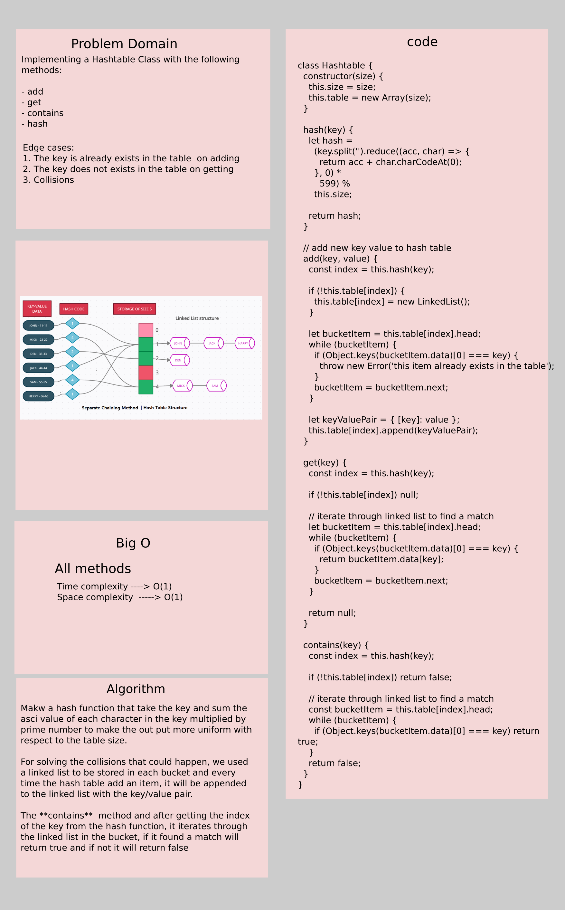

# Hashtables

Hash Table is a data structure which stores data in an associative manner. In a hash table, data is stored in an array format, where each data value has its own unique index value. Access of data becomes very fast if we know the index of the desired data.

**Hashing** is a technique to convert a range of key values into a range of indexes of an array. We're going to use modulo operator to get a range of key values.

## Challenge

Implementing a Hashtable Class with the following methods:

- add
- get
- contains
- hash

## Approach & Efficiency

The approach that we took, is by making a hash function that take the key and sum the asci value of each character in the key multiplied by prime number to make the out put more uniform with respect to the table size.

For solving the collisions that could happen, we used a linked list to be stored in each bucket and every time the hash table add an item, it will be appended to the linked list with the key/value pair.

The **contains**  method and after getting the index of the key from the hash function, it iterates through the linked list in the bucket, if it found a match will return true and if not it will return false

## API

- **add**
  - Arguments: key, value
  - Returns: nothing
  - This method should hash the key, and add the key and value pair to the table, handling collisions as needed.
- **get**
  - Arguments: key
  - Returns: Value associated with that key in the table
- **contains**
  - Arguments: key
  - Returns: Boolean, indicating if the key exists in the table already.
- **hash**
  - Arguments: key
  - Returns: Index in the collection for that key

## Whiteboard

