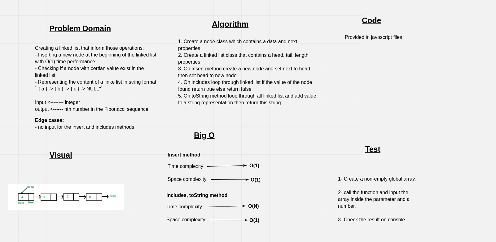

# Singly Linked List

A Linked List is a sequence of Nodes that are connected/linked to each other. The most defining feature of a Linked List is that each Node references the next Node in the link.

A Singly linked list means that there is only one reference, and the reference points to the Next node in a linked list.

## Challenge

Creating a linked list that inform those operations:

- Inserting a new node at the beginning of the linked list with O(1) time performance
- Checking if a node with certian value exist in the linked list
- Representing the content of a linke list in string format `"{ a } -> { b } -> { c } -> NULL"`

## Approach & Efficiency

**Inserting the node**:

Create a new node and change the new node next ponter to the head of the linked list then point then make the new node as the head of the linked list.

- *Time Complexity*: O(1).
- *Space Complexity*: O(1).

**Includes method**:

Looping through the linked list untill we find the node with the given value, then return `true`, if nothing was found then return `false`.

- *Time Complexity*: O(n).
- *Space Complexity*: O(1).

**To string representation**:

Looping through all the linked list nodes and appending the string representation of each node to the final representation then return the last representation.

- *Time Complexity*: O(n).
- *Space Complexity*: O(1).

## API

1. **Insert**:  Takes any value as an argument and adds a new node with that value to the head of the list with an O(1) Time performance.
2. **includes**: Takes any value as an argument and returns a boolean result depending on whether that value exists as a Node’s value somewhere within the list.
3. **toString**: Takes in no arguments and returns a string representing all the values in the Linked List, formatted as: `"{ a } -> { b } -> { c } -> NULL"`

## Whiteboard

