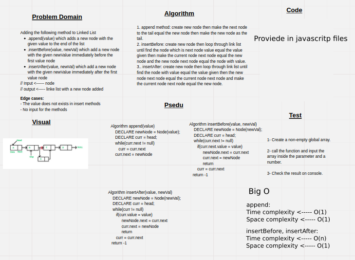

# Challenge Summary

Write the following methods for the Linked List class:

- **.append(value)** which adds a new node with the given value to the end of the list
- **.insertBefore(value, newVal)** which add a new node with the given newValue immediately before the first value node
- **.insertAfter(value, newVal)** which add a new node with the given newValue immediately after the first value node

## Whiteboard Process



## Approach & Efficiency

For **append** method I used the tail pointer to make the time complexity of the algorithm constant time by making a new node make and make the previous tail next point to it and reassigning the tail pointer to the new node.

For **insertBefore** method after creating new node I used a loop to find the node which is before the node with the value we are looking for then make the current node points to the new node and the new node points to the node with the value we are looked for.

For **insertAfter** method after creating new node I used a loop to find the node which is has the value we are looking for then make it points to the new nodeand the new node points to the next node of node that has the value we are looked for.

## Solution

```javascript
// create an empty linked list
let li = new LinkedList();

// add multi nodes to the start of the linked list
li.insert(5); // '{ 5 } -> NULL'
li.insert(10); // '{ 10 } -> { 5 } -> NULL'
li.insert(15); // '{ 15 } -> { 10 } -> { 5 } -> NULL'
li.insert(20); // '{ 20 } -> { 15 } -> { 10 } -> { 5 } -> NULL'
li.insert(25); // '{ 25 } -> { 20 } -> { 15 } -> { 10 } -> { 5 } -> NULL'

// add multi nodes to the start of the linked list
li.append(30); // '{ 25 } -> { 20 } -> { 15 } -> { 10 } -> { 5 } -> { 30 } -> NULL'
li.append(35); // '{ 25 } -> { 20 } -> { 15 } -> { 10 } -> { 5 } -> { 30 } -> { 35 } -> NULL'

// insert node before certian node 
li.insertBefore(15, 40); // '{ 25 } -> { 20 } -> { 40 } -> { 15 } -> { 10 } -> { 5 } -> { 30 } -> { 35 } -> NULL'

// insert node after certian node
li.insertAfter(20, 45); // '{ 25 } -> { 20 } -> { 45 } -> { 40 } -> { 15 } -> { 10 } -> { 5 } -> { 30 } -> { 35 } -> NULL'

// console log the string representation
console.log(li.toString()); // '{ 25 } -> { 20 } -> { 45 } -> { 40 } -> { 15 } -> { 10 } -> { 5 } -> { 30 } -> { 35 } -> NULL'
```
