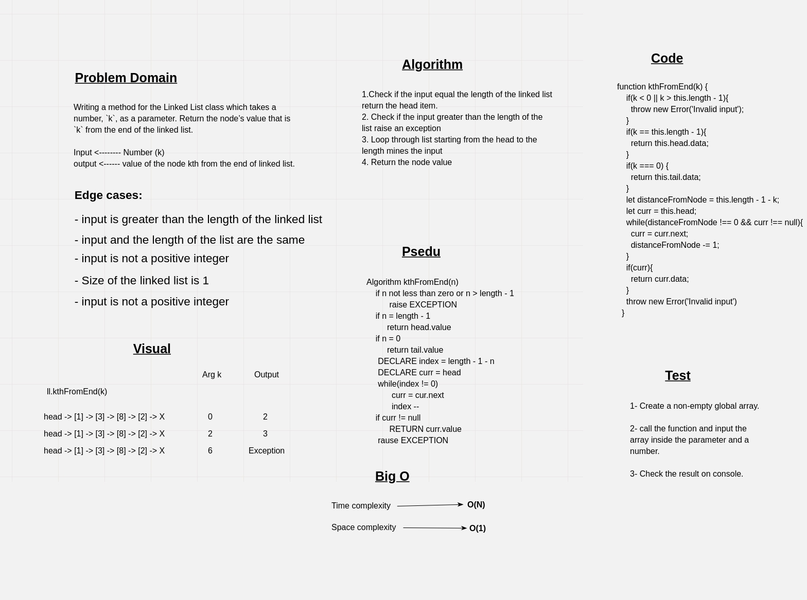

# Challenge Summary

Writing a method for the Linked List class which takes a number, `k`, as a parameter. Return the node’s value that is `k` from the end of the linked list.

## Whiteboard Process



## Approach & Efficiency

The approach that were taken is first to check for edge cases:

- If the input larger than the list items or negative number then raise an exception **(Big O <----- O(1) )**
- If the input equal the list items then return the head value **(Big O <----- O(1) )**
- If the input equal zero then return the taile value **(Big O <----- O(1) )**
- Calculate the distance from the the head to the target node using `distance = length -1 - input`
- Loop through the list and decrese the distance by one on each iteration and when it become zero return the value of the last node **(Big O <----- O(1) )**
- If nothing was found raise an exception too.

## Solution

```javascript
// create an empty linked list
let li = new LinkedList();

// add multi nodes to the start of the linked list
li.insert(2); // '{ 2 } > NULL'
li.insert(8); // '{ 8 } -> { 2 } -> NULL'
li.insert(3); // '{ 3 } -> { 8 } -> { 2 } -> NULL'
li.insert(1); // '{ 1 } -> { 3 } -> { 8 } -> { 2 } -> NULL'


// test the new method
console.log(li.kthFromEnd(0)) // Output -----> 2
console.log(li.kthFromEnd(3)) // Output -----> 1
console.log(li.kthFromEnd(2)) // Output -----> 3
console.log(li.kthFromEnd(6)) // Output -----> Exception
```
