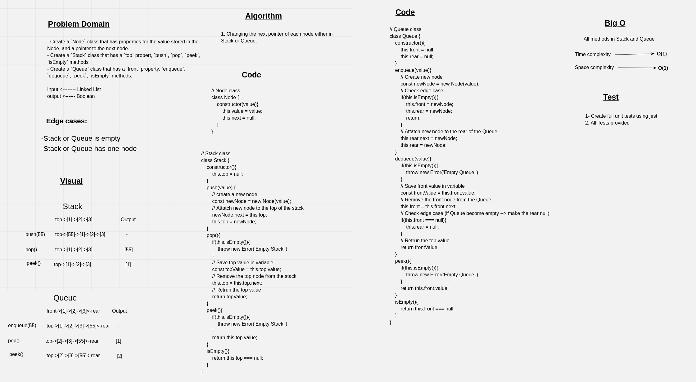

# Stacks and Queues

**Stack**:

A stack is a data structure that consists of `Nodes`. Each `Node` references the next Node in the stack, but does not reference its previous.

Common terminology for a stack is

- `Push` - Nodes or items that are put into the stack are pushed
- `Pop` - Nodes or items that are removed from the stack are popped. When you attempt to pop an empty stack an exception will be raised.
- `Top` - This is the top of the stack.
- `Peek` - When you peek you will view the value of the top Node in the stack. When you attempt to peek an empty stack an exception will be raised.
- `IsEmpty` - returns true when stack is empty otherwise returns false.

**Queue**:

Common terminology for a queue is

- `Enqueue` - Nodes or items that are added to the queue.
- `Dequeue` - Nodes or items that are removed from the queue. If called when the queue is empty an exception will be raised.
- `Front` - This is the front/first Node of the queue.
- `Rear` - This is the rear/last Node of the queue.
- `Peek` - When you peek you will view the value of the front Node in the queue. If called when the queue is empty an exception will be raised.
- `IsEmpty` - returns true when queue is empty otherwise returns false.

## Challenge

- Create a `Node` class that has properties for the value stored in the Node, and a pointer to the next node.
- Create a `Stack` class that has a `top` propert, `push`, `pop`, `peek`, `isEmpty` methods
- Create a `Queue` class that has a `front` property, `enqueue`, `dequeue`, `peek`, `isEmpty` methods.

## Approach & Efficiency

The appeoach that was taken for bothe Stack and Queue was using a node with next property point to the next node to make the efficience and time complexity of `push` in stack or `enqueue` in queue **O(1)**.

In addition a `rear` pointer was used in queue to make the time complexity of dequeue **O(1)** too.

**All methods take O(1) time complexity and O(1) space complexity.**

## API

1. **Stack**:
   - *top property*: Point to the top of the stack
   - *push method*: Takes any value as an argument and adds a new node with that value to the top of the stack with an O(1) Time performance.
   - *pop method*: Does not take any argument, removes the node from the top of the stack, and returns the node’s value. (Raising an exception when called on empty stack).
   - *peek method*: Does not take an argument and returns the value of the node located on top of the stack, without removing it from the stack. (Raising an exception when called on empty stack).
   - *isEmpty method*: Takes no argument, and returns a boolean indicating whether or not the stack is empty.

2. **Queue**:
   - *front property*: Point to the front of the queue
   - *rear property*: Point to the tail of the queue
   - *enqueue method*: Takes any value as an argument and adds a new node with that value to the back of the queue with an O(1) Time performance.
   - *dequeue method*: Does not take any argument, removes the node from the front of the queue, and returns the node’s value. (Raising an exception when called on empty queue).
   - *peek method*: Does not take an argument and returns the value of the node located in the front of the queue, without removing it from the queue. . (Raising an exception when called on empty queue).
   - *isEmpty method*: Taakes no argument, and returns a boolean indicating whether or not the queue is empty.

## Whiteboaerd

