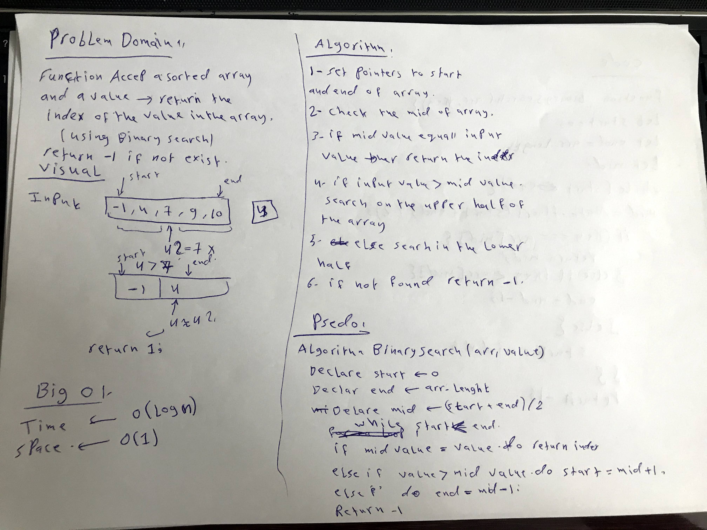
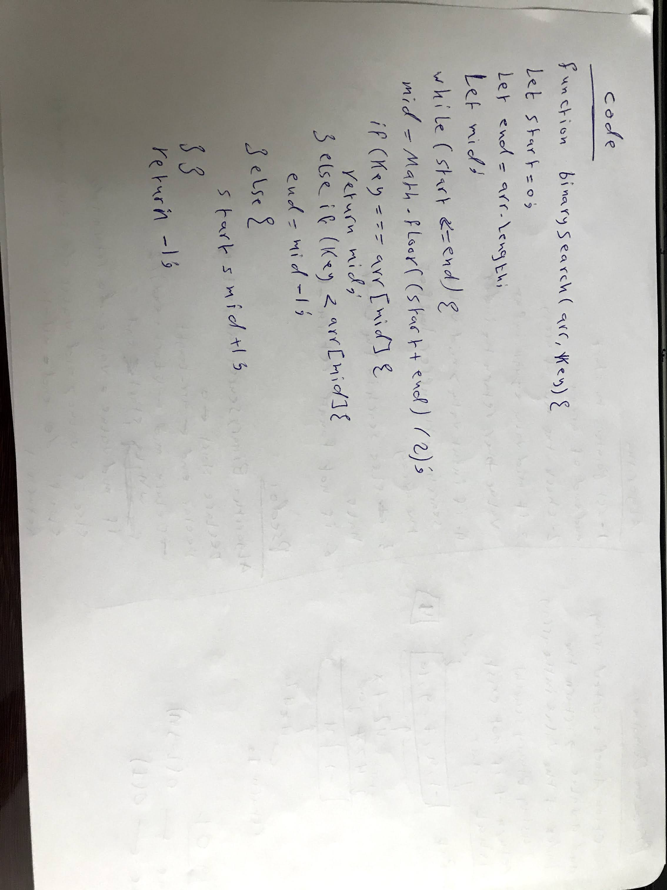

# Array Binary Search

Writing a function called BinarySearch which takes in 2 parameters: a sorted array and the search key. Without utilizing any of the built-in methods available in javascript language, return the index of the array’s element that is equal to the value of the search key, or -1 if the element is not in the array.

## Whiteboard Process




## Code

```javascript
function binarySearch(arr, key){
  let start = 0;
  let end = arr.length - 1;
  let mid;

  while(start <= end){
    mid = Math.floor((start + end) / 2);
    if(key === arr[mid]){
      return mid;
    } else if (key < arr[mid]){
      end = mid - 1;
    } else {
      start = mid + 1;
    }
  }
  return -1;
}
```

## Approach & Efficiency

The approach that was taken is make a pointers to the start and end of the array then calculate the mind point index, after that compare the key with the mid index value in the array, if it match then the value was found and return the index (mid), if not match check if the key less that the mid value then search on the first half of the array else search in the second part of the array, if the key not found then return -1.

**The time Big O**  -----> O(log(n))

**The space Big O** -----> O(1)
