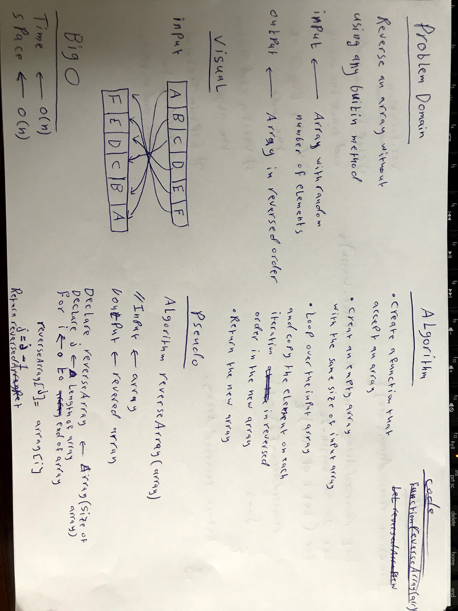
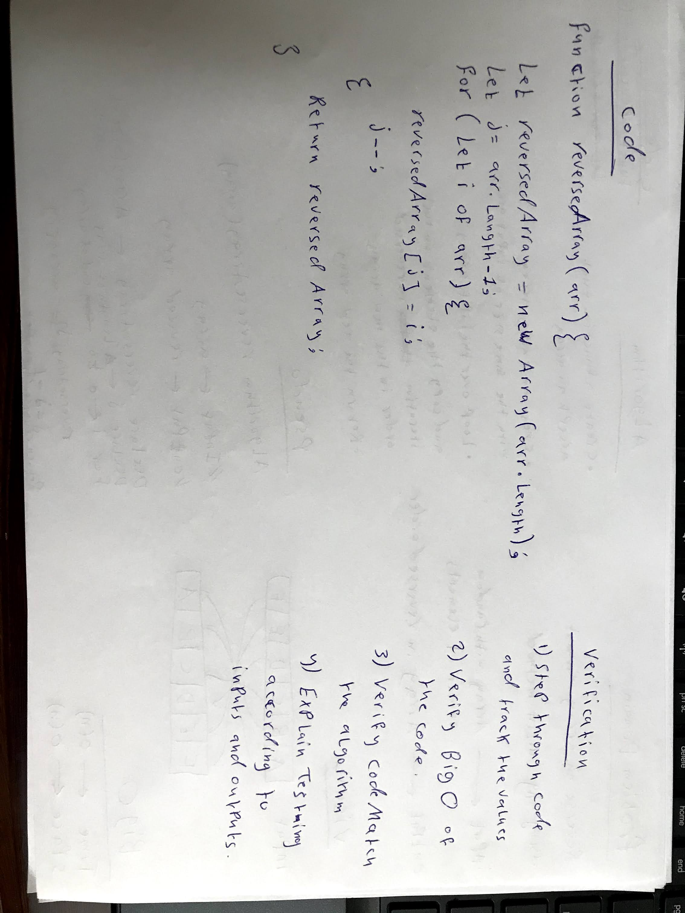

# Reverse an Array

Writing a function called reverseArray which takes an array as an argument. Without utilizing any of the built-in methods available in javascript language, return an array with elements in reversed order.

## Whiteboard Process




## Code

```javascript
function reverseArray(arr){
  let reversedArray = new Array(arr.length - 1);
  let j = arr.length - 1;
  for(let i of arr){
    reversedArray[j] = i;
    j--;
  }
  return reversedArray;
}

let arr = ['a', 'b', 'c', 'd'];

let newArr = reverseArray(arr);

console.log('old array : ', arr);
console.log('new array : ', newArr);
```

## Approach & Efficiency

The approach that was taken is making an empty array of the same size and loop through the original array then copy each element in it's new place in the new array. This approach very simple and need just one loop.

**The time Big O**  -----> O(n)

**The space Big O** -----> O(n)