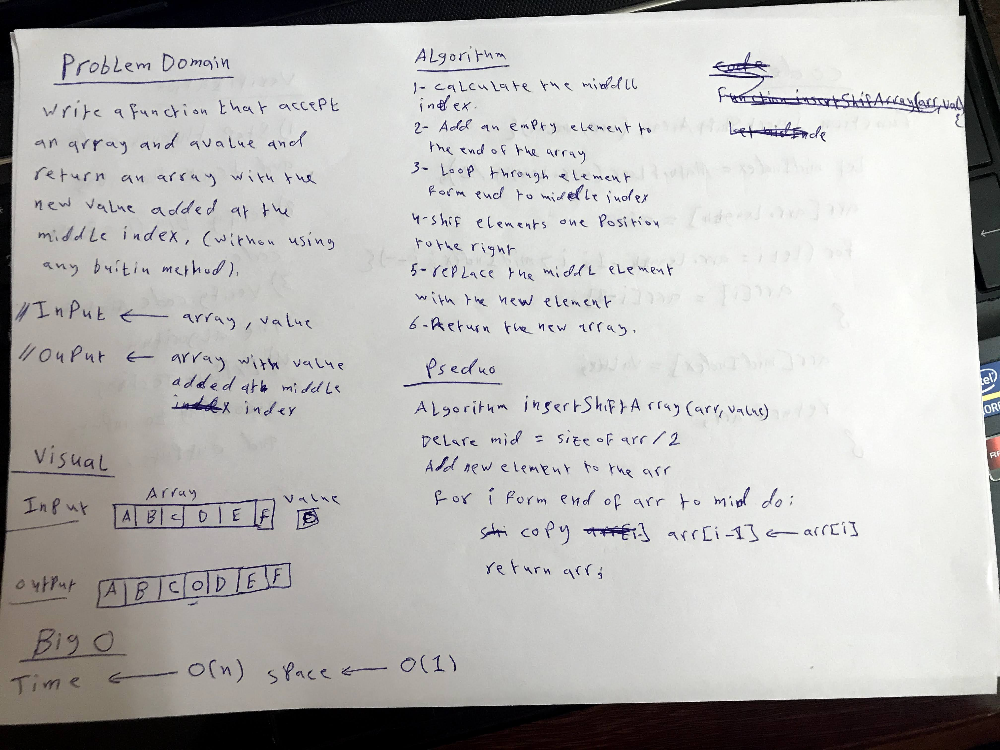
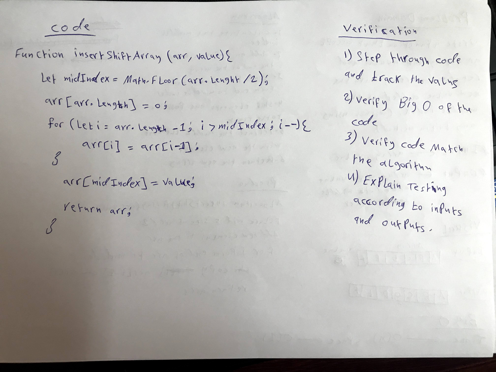

# Reverse an Array

Writing a function called insertShiftArray which takes an array and a value as an arguments. Without utilizing any of the built-in methods available in javascript language, eturn an array with the new value added at the middle index.

## Whiteboard Process




## Code

```javascript
function insertShiftArray(arr, value){
  let midIndex = Math.floor(arr.length / 2);
  arr[arr.length] = 0;

  for(let i = arr.length - 1; i > midIndex; i--){
    arr[i] = arr[i - 1];
  }
  arr[midIndex] = value;
  
  return arr;
}

let arr1 = [2, 4, 6, -8];
let arr2 = [24, 8, 15, 23, 42, 16];

console.log('array1 before :', arr1);
insertShiftArray(arr1, 5);
console.log('array1 after inserting 5 at the middle index :', arr1);

console.log('array2 before :', arr2);
let newArr2 = insertShiftArray(arr2, 16);
console.log('array2 after inserting  at the middle index :', arr2);

```

## Approach & Efficiency

The approach that was taken is by adding an element to the array with any inital value then calcaulating the middle index of the array. After that loop through half of the array to shift each element by one position to the right. This approach is easy to implement and need a fixed space to be implemented.

**The time Big O**  -----> O(n)

**The space Big O** -----> O(1)
