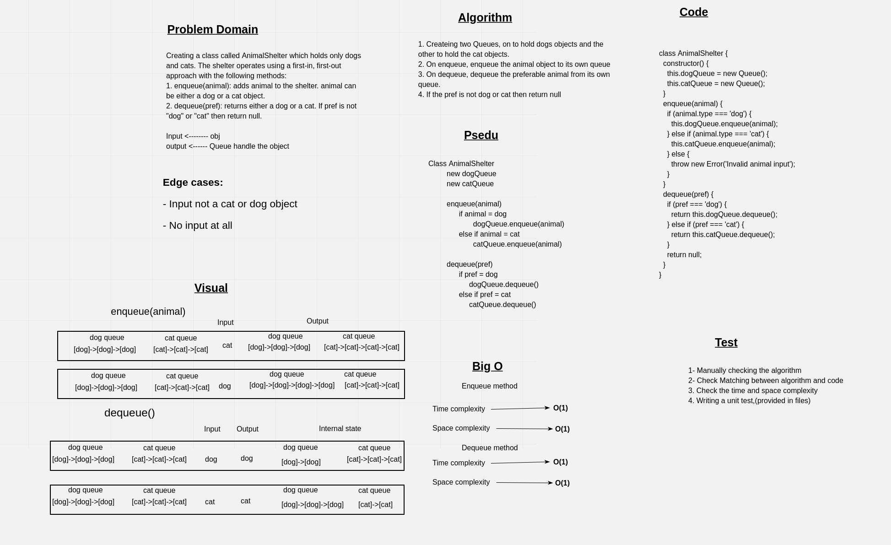

# Challenge Summary

Creating a class called AnimalShelter which holds only dogs and cats. The shelter operates using a first-in, first-out approach with the following methods:

1. enqueue(animal): adds animal to the shelter. animal can be either a dog or a cat object.

2. dequeue(pref): returns either a dog or a cat. If pref is not "dog" or "cat" then return null.

## Whiteboard Process



## Approach & Efficiency

The approach that was teken is by creating two Queues to make the efficincy better and making the time complexity of all operations to be constant time, on queue is to store dogs objects and the other queue is to store the cats objects.

On enqueue method, the animal object will be enqueu to its spesicfic queue besed on the type of the animal

If the type of the animal sent to the method was not a dog or cat then it will throw an error.

On dequeue method, the animal object will be dequeue to its spesicfic queue besed on the preferable type of animal that was sent to the method

If the preferable type wan not a dog or a cat then it will return null.

**Efficiency**:

All methods take:

- Time complexity ------> O(1)
- Space complexity ------> O(1)

## Solution

```javascript
// create a shelter object
const animalShelter = new AnimalShelter();

// make a set of dogs and cats objects
const dog1 = {
      type: 'dog',
      name: 'doggy',
    };
const dog2 = {
    type: 'dog',
    name: 'deego',
};
const dog3 = {
    type: 'dog',
    name: 'doogo',
};

const cat1 = {
      type: 'cat',
      name: 'caaaty',
    };
const cat2 = {
    type: 'cat',
    name: 'ketty',
};
const cat3 = {
    type: 'cat',
    name: 'ketto',
};

//  enqueue some dogs objects
animalShelter.enqueue(dog1);
animalShelter.enqueue(dog2);
animalShelter.enqueue(dog3);

//  enqueue some cats objects
animalShelter.enqueue(cat1);
animalShelter.enqueue(cat2);
animalShelter.enqueue(cat3);

//  dequeue dogs objects
let result1 = animalShelter.dequeue('dog'); // dog1
let result2 = animalShelter.dequeue('dog'); // dog2
let result3 = animalShelter.dequeue('dog'); // dog3

//  dequeue cats objects
let result1 = animalShelter.dequeue('cat'); // cat1
let result2 = animalShelter.dequeue('cat'); // cat2
let result3 = animalShelter.dequeue('cat'); // cat3
```
