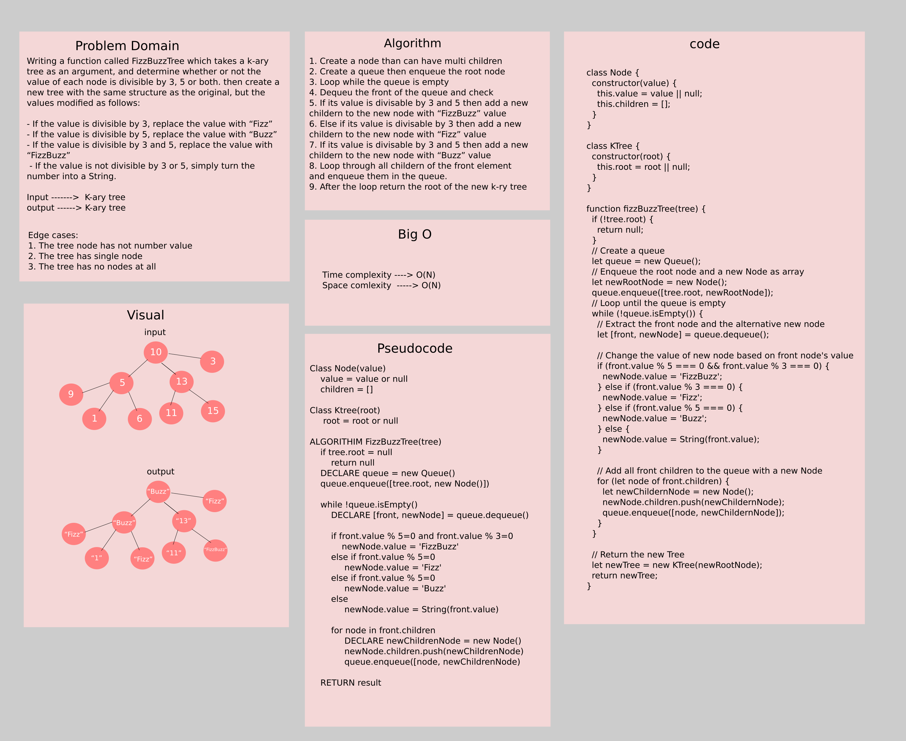

# Challenge Summary

Writing a function called FizzBuzzTree which takes a k-ary tree as an argument, and determine whether or not the value of each node is divisible by 3, 5 or both. then create a new tree with the same structure as the original, but the values modified as follows: 

- If the value is divisible by 3, replace the value with “Fizz”
- If the value is divisible by 5, replace the value with “Buzz”
- If the value is divisible by 3 and 5, replace the value with “FizzBuzz”
- If the value is not divisible by 3 or 5, simply turn the number into a String.

## Whiteboard Process



## Approach & Efficiency

The approach that was taken is by using the Breadth First Traverse and on each iteration we enqueue not just the node but also a new node that will take the new value in the new tree.

The algorithim as follow:

1. Create a node than can have multi children
2. Create a queue then enqueue the root node
3. Loop while the queue is empty
4. Dequeu the front of the queue and check
5. If its value is divisable by 3 and 5 then add a new childern to the new node with “FizzBuzz” value
6. Else if its value is divisable by 3 then add a new childern to the new node with “Fizz” value
7. If its value is divisable by 3 and 5 then add a new childern to the new node with “Buzz” value
8. Loop through all childern of the front element and enqueue them in the queue.
9. After the loop return the root of the new k-ry tree

**Efficiency**:

- Time complexity ------> O(N)
- Space complexity ------> O(N)

## Solution

```js
// Create the k-ry tree
let one = new Node(1);
let three = new Node(3);
let five = new Node(5);
let six = new Node(6);
let nine = new Node(9);
let ten = new Node(10);
let eleven = new Node(11);
let thirteen = new Node(13);
let fifteen = new Node(15);
// Connect the nodes
ten.children = [five, thirteen, three];
five.children = [nine, one, six];
thirteen.children = [eleven, fifteen];
//                      10
//             5        13        3 
//         9  1  6    11   15      
let tree = new KTree(ten);
// Run the function
let newTree = fizzBuzzTree(tree);

console.log(newTree); // The result will be the tree but with values of the nodes changed accordengly 
```
