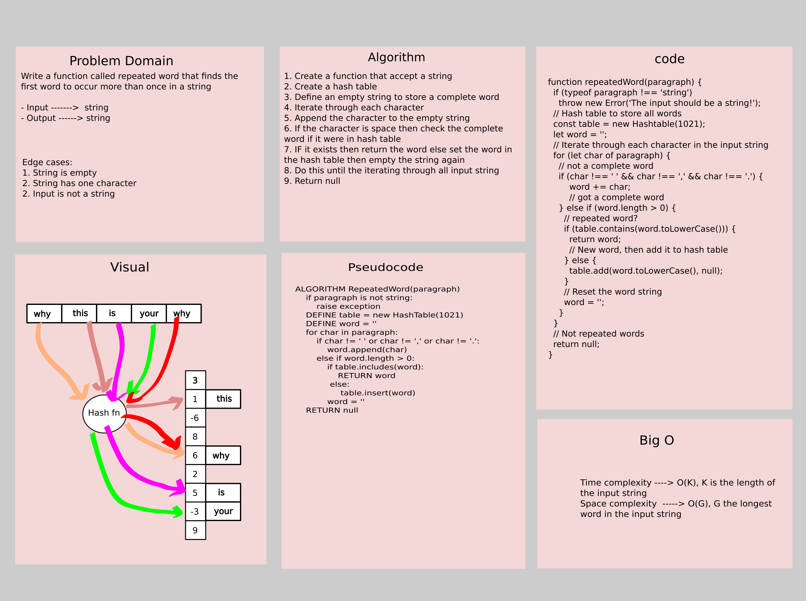

# Challenge Summary

Write a function called repeated word that finds the first word to occur more than once in a string

- Input ------->  string
- Output ------> string

## Whiteboard Process



## Approach & Efficiency

The approach that was taken is as follow:

1. Create a function that accept a string
2. Create a hash table
3. Define an empty string to store a complete word
4. Iterate through each character
5. Append the character to the empty string
6. If the character is space then check the complete word if it were in hash table
7. IF it exists then return the word else set the word in the hash table then empty the string again
8. Do this until the iterating through all input string
9. Return null

## Solution

```js
// String to be checked
let string =
      'It was the best of times, it was the worst of times, it was the age of wisdom, it was the age of foolishness, it was the epoch of belief, it was the epoch of incredulity, it was the season of Light, it was the season of Darkness, it was the spring of hope, it was the winter of despair, we had everything before us, we had nothing before us, we were all going direct to Heaven, we were all going direct the other way – in short, the period was so far like the present period, that some of its noisiest authorities insisted on its being received, for good or for evil, in the superlative degree of comparison only...';

// Call the function to get first repeated word
const result = repeatedWord(string);

console.log(result); // The output will be "it"
```
