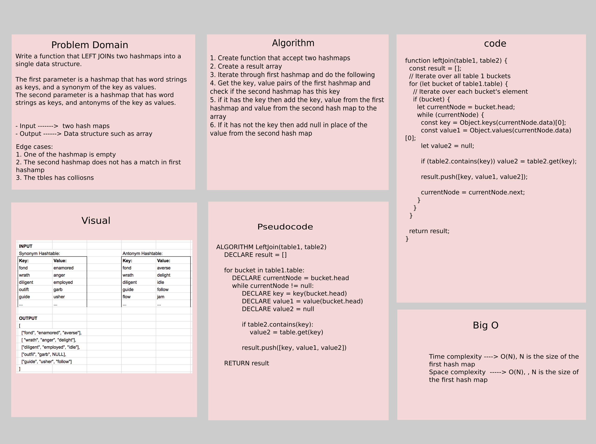

# Challenge Summary

Write a function that LEFT JOINs two hashmaps into a single data structure.

The first parameter is a hashmap that has word strings as keys, and a synonym of the key as values.

The second parameter is a hashmap that has word strings as keys, and antonyms of the key as values.

- Input ------->  two hash maps 
- Output ------> Data structure such as array

## Whiteboard Process



## Approach & Efficiency

The approach that was taken is as follow:

1. Create function that accept two hashmaps
2. Create a result array
3. Iterate through first hashmap and do the following
4. Get the key, value pairs of the first hashmap and check if the second hashmap has this key
5. if it has the key then add the key, value from the first hashmap and value from the second hash map to the array
6. If it has not the key then add null in place of the value from the second hash map 

- **Efficiency**:

- **Time complexity** ----> O(N), N is the size of the first hash map
- **Space complexity**  -----> O(N), , N is the size of the first hash map

## Solution

```js
// creating hash tables and add items to it
const table1 = new Hashtable(1021);
table1.add('fond', 'enamored');
table1.add('dnof', 'anger');
table1.add('diligent', 'employed');
table1.add('outfit', 'garb');
table1.add('tiftuo', 'usher');

const table2 = new Hashtable(1021);
table2.add('fond', 'averse');
table2.add('dnof', 'delight');
table2.add('diligent', 'idle');
table2.add('tiftuo', 'follow');
table2.add('flow', 'jam');
const expectedItems = [
    ['fond', 'enamored', 'averse'],
    ['dnof', 'anger', 'delight'],
    ['outfit', 'garb', null],
    ['tiftuo', 'usher', 'follow'],
    ['diligent', 'employed', 'idle'],
];

// Call the function to left join the tables
const result = leftJoin(table1, table2);

console.log(result); 
// The output will be 
// [
//     ['fond', 'enamored', 'averse'],
//     ['dnof', 'anger', 'delight'],
//     ['outfit', 'garb', null],
//     ['tiftuo', 'usher', 'follow'],
//     ['diligent', 'employed', 'idle'],
// ]
```
