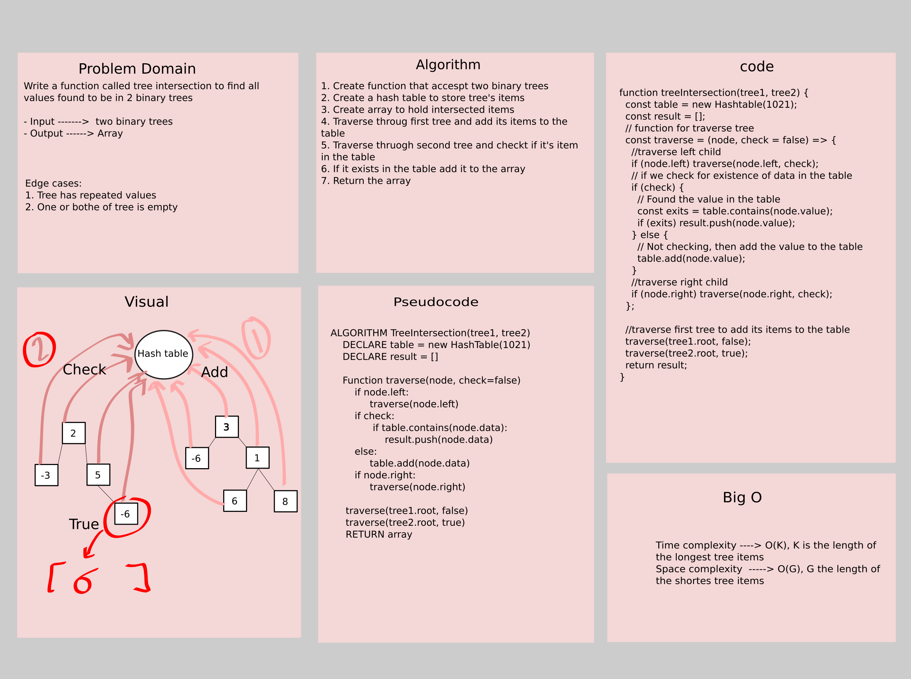

# Challenge Summary

Write a function called tree intersection to find all values found to be in 2 binary trees

- Input ------->  two binary trees
- Output ------> Array

## Whiteboard Process



## Approach & Efficiency

The approach that was taken is as follow:
1. Create function that accespt two binary trees
2. Create a hash table to store tree's items
3. Create array to hold intersected items
4. Traverse throug first tree and add its items to the table
5. Traverse thruogh second tree and checkt if it's item in the table
6. If it exists in the table add it to the array
7. Return the array

**Efficiency**:

- Time complexity ----> O(K), K is the length of the longest tree items
- Space complexity  -----> O(G), G the length of the shortes tree items 

## Solution

```js
// Create nodes for tree1
    let node150 = new Node(150);
    let node100 = new Node(100);
    let node250 = new Node(250);
    let node75 = new Node(75);
    let node160 = new Node(160);
    let node200 = new Node(200);
    let node350 = new Node(350);
    let node125 = new Node(125);
    let node175 = new Node(175);
    let node300 = new Node(300);
    let node500 = new Node(500);
    let node700 = new Node(700);
    // Connect the nodes for tree1
    node150.left = node100;
    node100.left = node75;
    node100.right = node160;
    node150.right = node250;
    node250.left = node200;
    node250.right = node350;
    // create a binary tree1
    let tree1 = new BinaryTree(node150);
    //          150
    //       100      250
    //     75   160  200   350

    // Connect the nodes for tree2
    node175.left = node125;
    node175.right = node300;
    node300.left = node500;
    node300.right = node700;
    node125.left = node100;
    // create a binary tree2
    let tree2 = new BinaryTree(node175);
    //           175
    //        125    300
    //      100     500   700
    //    75   160

    // Act
    const result = treeIntersection(tree1, tree2);
    // Assert
    console.log(result); // The output will be [100, 75, 160]
```
