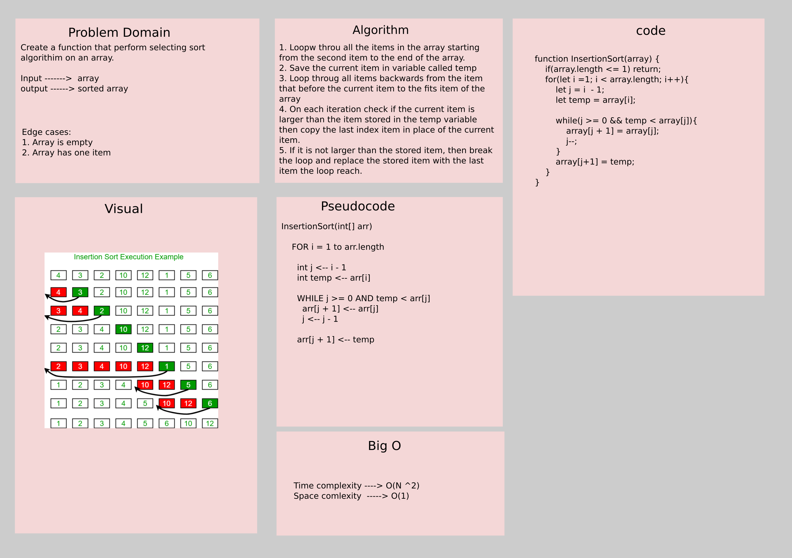

# Challenge Summary

Create a function that perform selecting sort algorithm on an array.

- Input ------->  array
- Output ------> sorted array

## Whiteboard Process



## Approach & Efficiency

1. Loop through all the items in the array starting from the second item to the end of the array.
2. Save the current item in variable called temp
3. Loop through all items backwards from the item that before the current item to the fits item of the array
4. On each iteration check if the current item is larger than the item stored in the temp variable then copy the last index item in place of the current item.
5. If it is not larger than the stored item, then break the loop and replace the stored item with the last item the loop reach.

**Efficiency**:

- Time complexity ----> O(N ^2)
- Space complexity  -----> O(1)

## Solution

```js
// Create an unsorted array
let arr = [2, 1, -1, 39, 7 ,25 ,15];
// Invoke the function
InsertionSort(arr);
// The array now is sorted
console.log(arr); // the output should be [-1, 1, 2, 7, 15, 25, 39]
```
