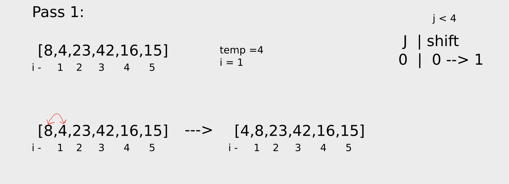
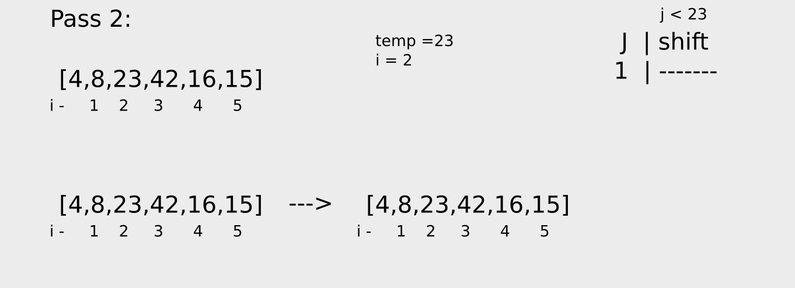
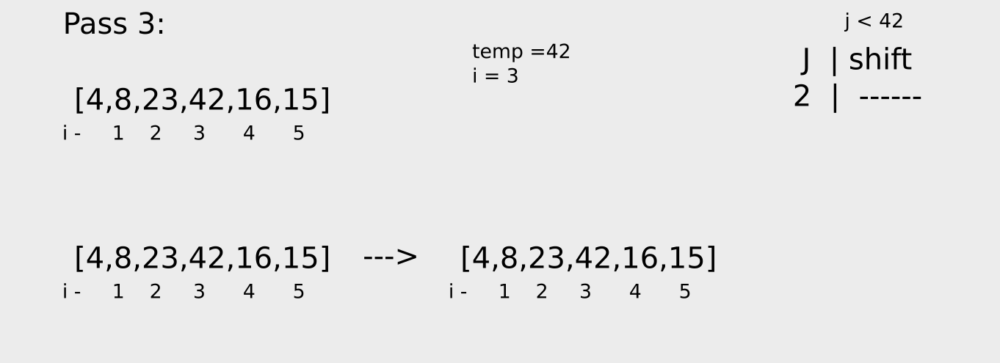
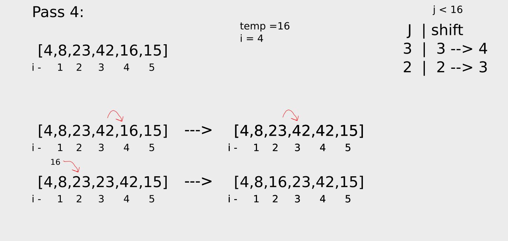
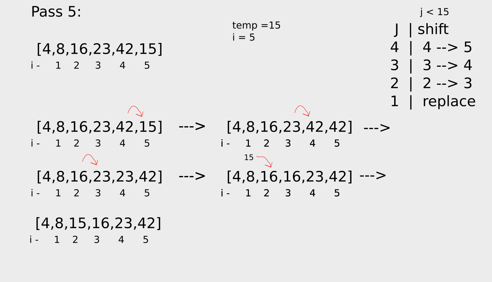

# Insertion Sort

Insertion sort is a simple sorting algorithm that builds the final sorted array one item at a time. It is much less efficient on large lists than more advanced algorithms such as quicksort, heapsort, or merge sort.

## Pseudocode

```
SelectionSort(int[] arr)
 InsertionSort(int[] arr)
  
    FOR i = 1 to arr.length
    
      int j <-- i - 1
      int temp <-- arr[i]
      
      WHILE j >= 0 AND temp < arr[j]
        arr[j + 1] <-- arr[j]
        j <-- j - 1
        
      arr[j + 1] <-- temp
```

## Trace

Sample Array: `[8,4,23,42,16,15]`



In the first pass through of the inserting sort, we store the value of the second element (we stats from the second element) in a variable for later usage and compare it with all previous values until we reach the start of the array or the previous value is larger than the the stored value.

After completing the comparison, we replaced the the value of that we stopped on with the stored value. This means on each iteration the the value will be placed on its appropriate position.



In the second pass we repeat the first steps but starting from the third item in the array.





After iterating over all the items in the array, the array will be sorted.


## Efficiency

- Time: O(n^2)
    The basic operation of this algorithm is comparison. This will happen `n * (1) + n * (2) + .. + n * (n-1)` number of times…concluding the algorithm to be n squared.
- Space: O(1)
    No additional space is being created. This array is being sorted in place…keeping the space at constant O(1).
