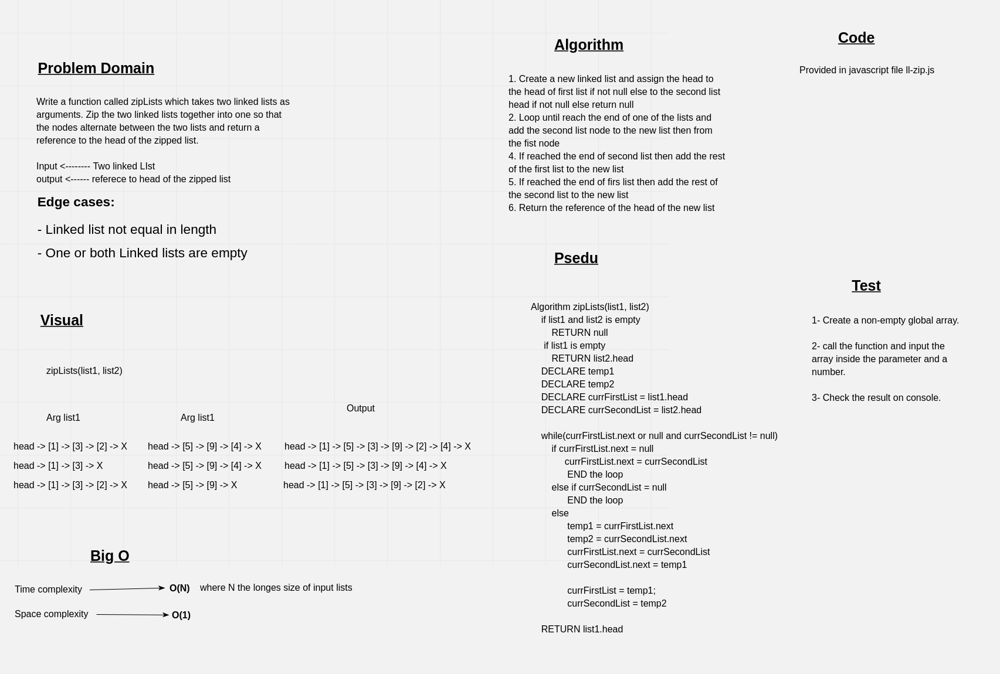

# Challenge Summary

Writing a function called **zipLists** which takes two linked lists as arguments. Zip the two linked lists together into one so that the nodes alternate between the two lists and return a reference to the head of the zipped list. With the access to the Node class and all the properties on the Linked List class as well as the methods created in previous challenges.

## Whiteboard Process



## Approach & Efficiency

- The approach was taken is by make two pointers to the first and second list for traversing
- starting from the head of the first node if not null else from the head from the second list
- Then loop until we reach the end of any lists
- On each iteration we point a new node from the second first then from the first list
- After reaching the end of one of list we add the rest of nodes of the remaining list in sequence

- Time complexity < ------ O(N), where N is the size of longest list
- Space complexity < ------- O(1)

## Solution


```javascript
let list1 = new LinkedList();
// list1 head -> [1] -> [3] -> [2] -> X
list1.insert(2);
list1.insert(3);
list1.insert(1);

// list2 head -> [5] -> [9] -> [4] -> X
let list2 = new LinkedList();
list2.insert(4);
list2.insert(9);
list2.insert(5);

let head = zipLists(list1, list2)

console.log(head.data) // 5
```
