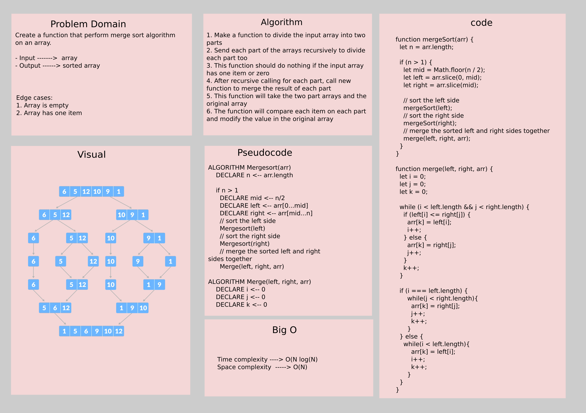

# Challenge Summary

Create a function that perform merge sort algorithm on an array.

- Input ------->  array
- Output ------> sorted array

## Whiteboard Process



## Approach & Efficiency

1. Make a function to divide the input array into two parts
2. Send each part of the arrays recursively to divide each part too
3. This function should do nothing if the input array has one item or zero
4. After recursive calling for each part, call new function to merge the result of each part
5. This function will take the two part arrays and the original array
6. The function will compare each item on each part and modify the value in the original array

**Efficiency**:

- Time complexity ----> O(Nlog(N))
- Space complexity  -----> O(N)

## Solution

```js
// Create an unsorted array
let arr = [2, 1, -1, 39, 7 ,25 ,15];
// Invoke the function
mergeSort(arr);
// The array now is sorted
console.log(arr); // the output should be [-1, 1, 2, 7, 15, 25, 39]
```

[blog article](blog.md)