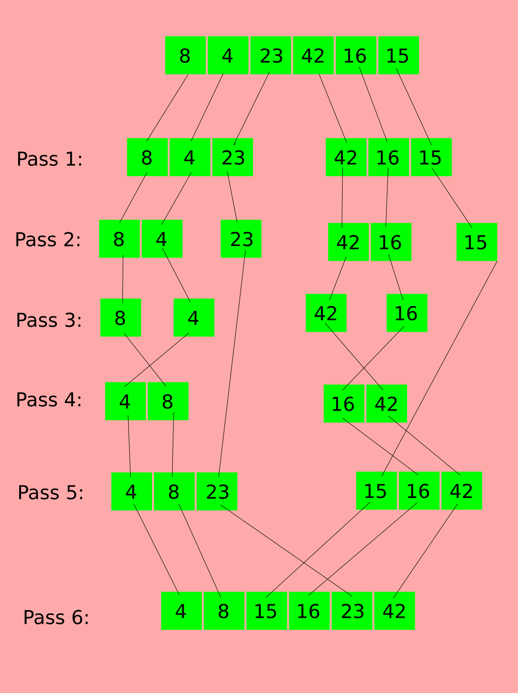

# Merge Sort Algorithm

## What it is?

Merge Sort is a sorting algorithm, which is commonly used in computer science. Merge Sort is a divide and conquer algorithm. It works by recursively breaking down a problem into two or more sub-problems of the same or related type, until these become simple enough to be solved directly. The solutions to the sub-problems are then combined to give a solution to the original problem. So Merge Sort first divides the array into equal halves and then combines them in a sorted manner.

## How it works?

- If it is only one element in the list it is already sorted, return.
- Divide the list recursively into two halves until it can no more be divided.
- Merge the smaller lists into new list in sorted order.

Bellow is an image the describe the steps for merge sort algorithm:



**Pass1 **:

In this step the array is divided two halves, and this will continue until the sub-array is going to have one item.

**Pass 2**:

Two sub-arrays now contains just one element, so they are not going to be divided further.

**Pass 3**:

In this step all the sub-array now have one items, so we can solve the problem and merge the results as  in the next step.

**Pass 4**:

Here the two items from each sub-array is compared and sorted, and the result is merged in one array.

**Pass 5**:

The marging process is continuing, and on each merge step we compare all items from the two sub-arrays and sort them.

**Pass 6**:

At the end, when the all the sub-arrays is merged, the resulting array will be sorted.

## Pseudocode

```

ALGORITHM Mergesort(arr)
    DECLARE n <-- arr.length
           
    if n > 1
      DECLARE mid <-- n/2
      DECLARE left <-- arr[0...mid]
      DECLARE right <-- arr[mid...n]
      // sort the left side
      Mergesort(left)
      // sort the right side
      Mergesort(right)
      // merge the sorted left and right sides together
      Merge(left, right, arr)

ALGORITHM Merge(left, right, arr)
    DECLARE i <-- 0
    DECLARE j <-- 0
    DECLARE k <-- 0

    while i < left.length && j < right.length
        if left[i] <= right[j]
            arr[k] <-- left[i]
            i <-- i + 1
        else
            arr[k] <-- right[j]
            j <-- j + 1
            
        k <-- k + 1

    if i = left.length
       set remaining entries in arr to remaining values in right
    else
       set remaining entries in arr to remaining values in left

```

## Efficiency

- **Time**: `O(nlog(n))`
    Merge Sort is a recursive algorithm and time complexity can be expressed as following recurrence relation `T(n) = 2T(n/2) + O(n)`. The list of size N is divided into a max of Logn parts, and the merging of all sublists into a single list takes O(N) time, the worst-case run time of this algorithm is O(nLogn)
- **Space**: `O(n)`
    Additional space is being created. This array is not sorted in place.
