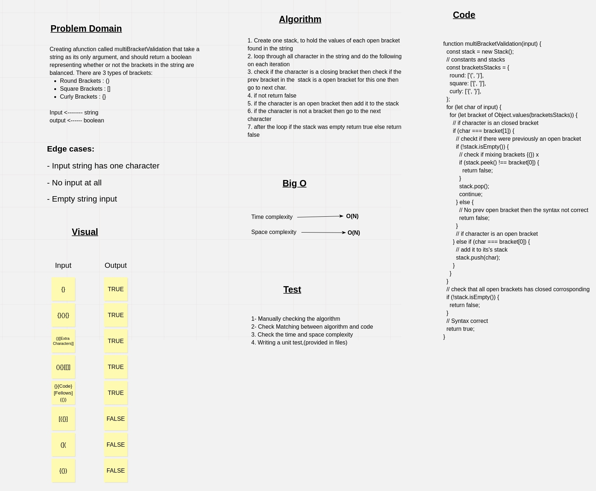

# Challenge Summary

Creating afunction called multiBracketValidation that take a string as its only argument, and should return a boolean representing whether or not the brackets in the string are balanced. There are 3 types of brackets:

- Round Brackets : `()`
- Square Brackets : `[]`
- Curly Brackets : `{}`

## Whiteboard Process



## Approach & Efficiency

The approach that was teken is by creating a stack to hold the values of each open bracket found in the string, then looping through all character in the string and do the following on each iteration.

1. loop through all character in the string and do the following on each iteration

2. check if the character is a closing bracket then check if the prev bracket in the  stack is a open bracket for this one then go to next char.

3. if not return false

4. if the character is an open bracket then add it to the stack

5. if the character is not a bracket then go to the next character.

6. after the loop if the stack was empty return true else return false

**Efficiency**:

- Time complexity ------> O(N)
- Space complexity ------> O(N)

## Solution

```javascript
// The string to be tested 
const testString = '{"yesthid"(s){(dfd)45} }';
// getting the result
const result = multiBracketValidation(testString);
// console the result
console.log(result); // true
```
