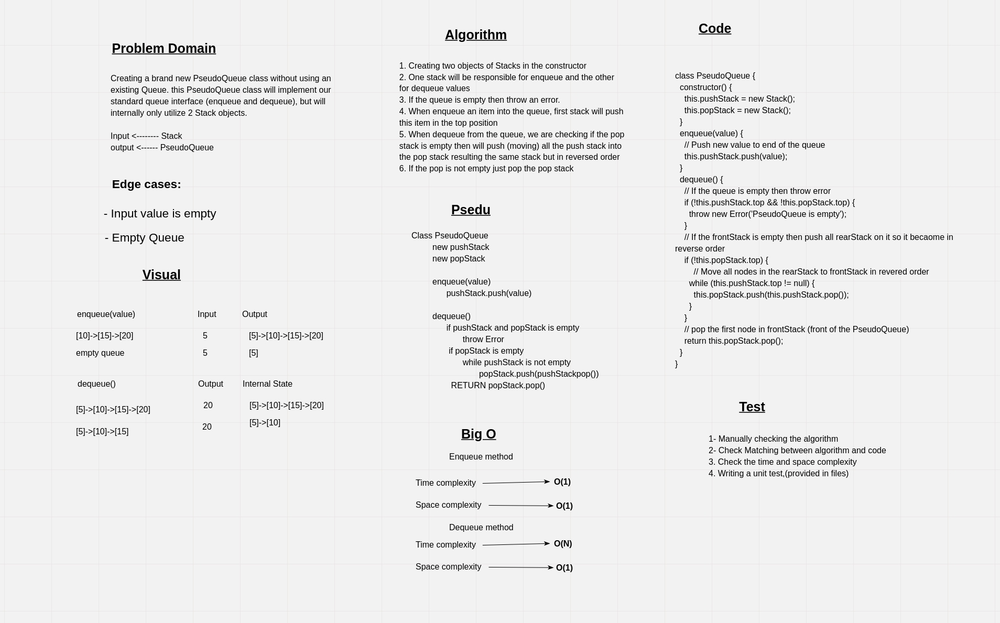

# Challenge Summary

Creating a brand new `PseudoQueue` class without using an existing Queue. this PseudoQueue class will implement our standard queue interface (`enqueue` and `dequeue`), but will internally only utilize 2 Stack objects.

## Whiteboard Process
<!-- Embedded whiteboard image -->


## Approach & Efficiency

- The approach that was taken is by creating two Stacks one for push (enqueue) the items to the queue and the other for pop (dequeue) it.
- If the queue is empty then throw an error.
- When enqueue an item into the queue, first stack will push this item in the top position.
- When dequeue from the queue, we are checking if the pop stack is empty then will push (moving) all the push stack into the pop stack resulting the same stack but in reversed order
- If the pop is not empty just pop the pop stack

- Enqueue method:
  - Time complexity ---> O(1)
  - Time complexity ---> O(1)
- Dequeue method:
  - Time complexity ---> O(N)
  - Time complexity ---> O(1)

## Solution

```javascript
// Creating a pseudoQueue
const pseudoQueue = new PseudoQueue();

// Enqueue items to the queue
pseudoQueue.enqueue(1);
// 1
pseudoQueue.enqueue(2);
// 2 -> 1
pseudoQueue.enqueue(3);
// 3 -> 2 -> 1
pseudoQueue.enqueue(4);
// 4 -> 3 -> 2 -> 1

// Dequeue items from the queue

conslole.log(pseudoQueue.dequeue()); // 1
// 4 -> 3 -> 2
conslole.log(pseudoQueue.dequeue()); // 2
// 4 -> 3
conslole.log(pseudoQueue.dequeue()); // 3
// 4 
conslole.log(pseudoQueue.dequeue()); // 4

```
