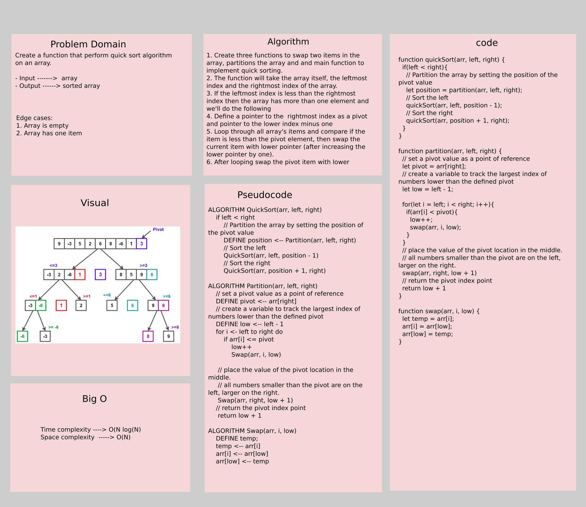

# Challenge Summary

Create a function that perform quick sort algorithm on an array.

- Input ------->  array
- Output ------> sorted array

## Whiteboard Process



## Approach & Efficiency

1. Create three functions to swap two items in the array, partitions the array and and main function to implement quick sorting.
2. The function will take the array itself, the leftmost index and the rightmost index of the array. 
3. If the leftmost index is less than the rightmost index then the array has more than one element and we'll do the following
4. Define a pointer to the  rightmost index as a pivot and pointer to the lower index minus one
5. Loop through all array's items and compare if the item is less than the pivot element, then swap the current item with lower pointer (after increasing the lower pointer by one).
6. After looping swap the pivot item with lower pointer's item
7. At this stage the array is sorted.

**Efficiency**:

- Time complexity ----> O(N^2)
- Space complexity  -----> O(log(N))

## Solution

```js
// Create an unsorted array
let arr = [2, 1, -1, 39, 7 ,25 ,15];
// Invoke the function
quickSort(arr, 0, arr.length - 1);
// The array now is sorted
console.log(arr); // the output should be [-1, 1, 2, 7, 15, 25, 39]
```

[blog article](blog.md)