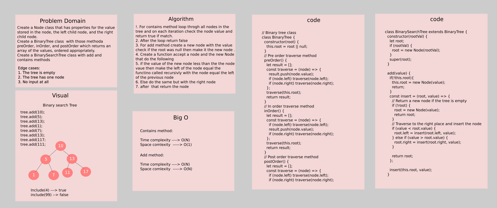

# Trees

## Common Terminology

- `Node` - A Tree node is a component which may contain it’s own values, and references to other nodes
- `Root` - The root is the node at the beginning of the tree
- `K` - A number that specifies the maximum number of children any node may have in a k-ary - - `tree`. In a binary tree, k = 2.
- `Left` - A reference to one child node, in a binary tree
- `Right` - A reference to the other child node, in a binary tree
- `Edge` - The edge in a tree is the link between a parent and child node
- `Leaf` - A leaf is a node that does not have any children
- `Height` - The height of a tree is the number of edges from the root to the furthest leaf

## Traversals

Traversing a tree allows us to search for a node, print out the contents of a tree, and much more!

There are two categories of traversals when it comes to trees:

1. Depth First
2. Breadth First

### Depth First

Depth first traversal is where we prioritize going through the depth (height) of the tree first. There are multiple ways to carry out depth first traversal, and each method changes the order in which we search/print the root. Here are three methods for depth first traversal:

- Pre-order: `root >> left >> right`
- In-order: `left >> root >> right`
- Post-order: `left >> right >> root`

The most common way to traverse through a tree is to use recursion. With these traversals, we rely on the call stack to navigate back up the tree when we have reached the end of a sub-path.

### Breadth First

Breadth first traversal iterates through the tree by going through each level of the tree node-by-node.

Traditionally, breadth first traversal uses a queue (instead of the call stack via recursion) to traverse the width/breadth of the tree. Let’s break down the process.

## Challenge

- Create a Node class that has properties for the value stored in the node, the left child node, and the right child node.
- Create a BinaryTree class
  - Define a method for each of the depth first traversals called preOrder, inOrder, and postOrder which returns an array of the values, ordered appropriately.

- Any exceptions or errors that come from your code should be semantic, capturable errors. For example, rather than a default error thrown by your language, your code should raise/throw a custom, semantic error that describes what went wrong in calling the methods you wrote for this lab.
- Create a BinarySearchTree class
  - Define a method named add that accepts a value, and adds a new node with that value in the correct location in the binary search tree.
  - Define a method named contains that accepts a value, and returns a boolean indicating whether or not the value is in the tree at least once.

## Approach & Efficiency

The approch that was taken for contains method is by loop and for add method is by recursive function call as bellow:

1. For contains method loop throgh all nodes in the tree and on each iteration check the node value and return true if match.
2. After the loop return false
3. For add method create a new node with the value  check if the root was null then make it the new node .
4. Create a function accept a node and the new Node that do the following 
5. if the value of the new node less than the the node vaue then make the left of the node equal the functino called recursivly with the node equal the left of the previous node
6. Else do the same but with the right node
7. after  that return the node  

**Contains Method**:

    **Time Complexity**  -----> O(N)

    **Space Complexity** -----> O(1)

**Add Method**:

    **Time Complexity**  -----> O(N)

    **Space Complexity** -----> O(N)

## API

**preOrder**: Return an array with depth first traversals using the pre order concept

**inOrder**: Return an array with depth first traversals using the inOrder concept

**postOrder**: Return an array with depth first traversals using the postOrder concept

**add**: Accepts a value, and adds a new node with that value in the correct location in the binary search tree.

**contains**: Accepts a value, and returns a boolean indicating whether or not the value is in the tree at least once.

## Whiteboard

