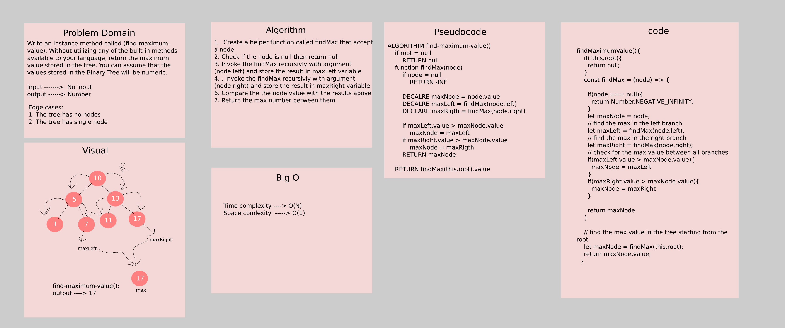

# Challenge Summary

Write an instance method called `find-maximum-value`. Without utilizing any of the built-in methods available to your language, return the maximum value stored in the tree. You can assume that the values stored in the Binary Tree will be numeric.

## Whiteboard Process



## Approach & Efficiency

The approch that was taken is by traversing through all nodes using recursive function invoke as below described:

1. Create a helper function called findMac that accept a node 
2. Check if the node is null then return null
3. Invoke the findMax recursivly with argument (node.left) and store the result in maxLeft variable
4. Invoke the findMax recursivly with argument (node.right) and store the result in maxRight variable
5. Compare the the node.value with the results above
6. Return the max number between them

**Time Complexity**  -----> O(N)

**Space Complexity** -----> O(1)

## Solution

```javascript
// Create nodes
let one = new Node(1);
let two = new Node(2);
let three = new Node(3);
let four = new Node(4);
let five = new Node(5);
let six = new Node(6);
let seven = new Node(7);
let eight = new Node(8);
let nine = new Node(9);
// Connect the nodes
one.left = two;
one.right = three;
two.left = six;
six.right = seven;
seven.left = eight;
seven.right = nine;
three.left = four;
three.right = five;
// create a binary tree
let tree = new BinaryTree(one);

// find the max value in the tree
let maxNumber = tree.findMaximumValue();
console.log(maxNumber); // The output will be 9
```
