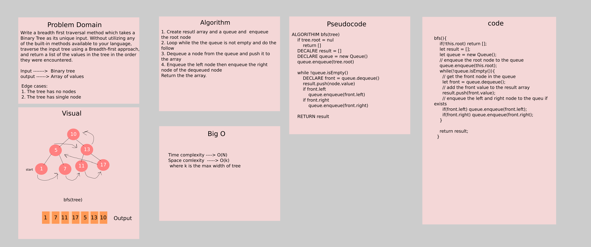

# Challenge Summary

Writing a breadth first traversal method which takes a Binary Tree as its unique input. Without utilizing any of the built-in methods available to your language, traverse the input tree using a Breadth-first approach, and return a list of the values in the tree in the order they were encountered.

## Whiteboard Process



## Approach & Efficiency

The approach that was taken is by using a while loop and a queue as described below:

1. Create result array and a queue and enqueue the root node
2. Loop while the the queue is not empty and do the follow
3. Dequeue a node from the queue and push it to the array
4. Enqueue the left node then enqueue the right node of the dequeued node
Return the the array.

**Time Complexity**  -----> O(N)

**Space Complexity** -----> O(k)

where k is the max width of tree

## Solution

```js
// Create nodes
let one = new Node(1);
let two = new Node(2);
let three = new Node(3);
let four = new Node(4);
let five = new Node(5);
let six = new Node(6);
let seven = new Node(7);
let eight = new Node(8);
let nine = new Node(9);
// Connect the nodes
one.left = two;
one.right = three;
two.left = six;
six.right = seven;
seven.left = eight;
seven.right = nine;
three.left = four;
three.right = five;
// create a binary tree
let tree = new BinaryTree(one);

// traverse the tree using breadth first
let maxNumber = tree.bfs();
console.log(maxNumber); // The output will be [1, 2, 3, 6, 4, 5, 7, 8, 9]
```

